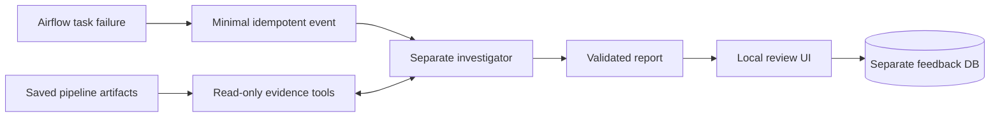

# Data Pipeline Incident Investigator

A local AI agent prototype that investigates failed data pipelines from saved evidence, produces a grounded incident report, and routes the report through human review.

Built with Python, DuckDB, Airflow 3, the OpenAI Responses API, and a standard-library web UI. All included data is synthetic.

## What it does

- Investigates Airflow failures through typed, bounded, read-only evidence tools.
- Requires evidence citations and abstains when evidence or budget is insufficient.
- Produces human-readable reports and a local `Useful / Incorrect / Uncertain` review queue.
- Evaluates model behavior against a fixed shortcut-resistant benchmark.

## Quick demo

Requires Python 3.9+.

```sh
python3 -m venv .venv
.venv/bin/python -m pip install -r requirements.txt
.venv/bin/python -m incident_pipeline.demo
```

Open [http://127.0.0.1:8765](http://127.0.0.1:8765).

The isolated demo contains:

- one healthy pipeline run;
- one Schema drift incident from a transform failure;
- one Data quality incident from duplicate IDs at validation;
- evidence-cited reports and the review UI.

Re-running does not accumulate incidents. This fast path exercises the same event, investigation, report, and UI boundaries without launching Airflow; the Docker smoke test verifies the real integration.

## Architecture



Key controls:

- no arbitrary SQL or pipeline-write tool;
- bounded evidence, model steps, and API calls;
- evidence-reference validation before accepting a report;
- `unknown` reports when evidence or budget is insufficient.

See [Architecture and acceptance criteria](docs/architecture.md) for component boundaries and current limits.

## Verified results

| Check | Result |
|---|---|
| Automated suite | 68 tests |
| Frozen v2 heldout evaluation | 6 synthetic cases, run once after prompt freeze |
| Heldout category accuracy | 83.33% |
| Heldout cause accuracy | 100% |
| Evidence validity / sufficiency | 100% / 100% |
| Heldout model calls | 19 |
| Airflow failure paths | Schema drift at transform; duplicate IDs at validate |
| Integration demo model cost | 0 API calls with the deterministic adapter |

These numbers describe fixed synthetic cases and do not estimate production accuracy. The heldout category miss is preserved without post-evaluation tuning.

## Verification and documentation

Fast offline acceptance path used by CI:

```sh
bash scripts/verify_local.sh
```

Real Airflow integration through Docker:

```sh
bash scripts/airflow_m4b_smoke.sh
```

The Docker smoke test verifies Airflow task states, identifier-only callbacks, one report per failed attempt, idempotent processing, zero model API calls, and no investigator data changes.

Deep dives:

- [Architecture, controls, and acceptance criteria](docs/architecture.md)
- [Airflow integration](airflow/README.md)
- [Benchmark v2 methodology and chronology](evaluation/v2/README.md)
- [Example incident report](reports/eval2_d008.md)
