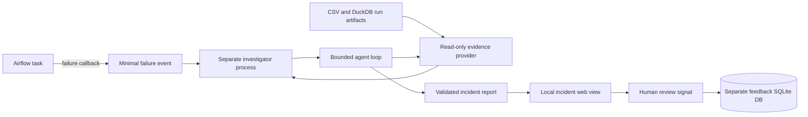

# Architecture and acceptance criteria

## Product goal

This local prototype investigates failed batch-pipeline runs from saved evidence, produces a grounded human-readable report, and collects a small human review signal. It is designed to make agent decisions inspectable: every diagnosis cites a bounded tool result, and the investigator cannot mutate pipeline data.

## Runtime flow

The callback carries only the DAG ID, Airflow run ID, task ID, attempt number, schema version, and deterministic event ID. Evidence lookup and model decisions happen later in a separate process, so callback work cannot replace the original task error.

## Two reproducible paths

| Path | Purpose | Airflow installed? | Evidence produced |
|---|---|---:|---|
| `python -m incident_pipeline.demo` | Fast product walkthrough in an isolated workspace | No | One healthy run, schema-drift report, duplicate-ID report, web review queue |
| `bash scripts/airflow_m4b_smoke.sh` | Real integration verification | Docker image | Airflow task states, callbacks, events, reports, idempotency result |

The fast demo calls the same pipeline stages, event contract, evidence adapter, investigator, report renderer, and web application. It is an Airflow-free harness and is not presented as an Airflow execution. The Docker smoke path is the integration proof.

## Component boundaries

| Component | Reads | Writes | Boundary |
|---|---|---|---|
| Pipeline stages | Allowlisted synthetic CSV | Run artifacts and DuckDB | Deterministic known runs only |
| Failure callback | Airflow identifiers | Minimal event JSON | No evidence reads and no model call |
| Evidence provider | Saved artifacts and DuckDB | Nothing | Read-only DuckDB; allowlisted tools and bounded output |
| Agent loop | Typed observations | In-memory trace and report | Tool/model-step budgets; evidence-reference validation |
| Report renderer | Validated investigation JSON | Markdown report | No model call; no raw sampled rows in report detail |
| Web view | Completed incident artifacts | Nothing in incident directories | Escaped and size-bounded artifact rendering |
| Feedback store | Event ID and review value | Dedicated SQLite DB | Three allowlisted values; one current value per event |

## Agent controls

- Evidence tools accept no arbitrary SQL and return bounded logs, schemas, profiles, or samples.
- The final report must cite reference IDs that exist in the recorded trace.
- Exhausted budgets, tool failures, and insufficient evidence return a partial `unknown` report instead of an invented diagnosis.
- The optional remediation tool runs fixed candidates in an in-memory sandbox and reports `changes_made: false`.
- OpenAI usage is explicit and opt-in. Tests and demo commands use the deterministic local adapter and spend no API credits.

## Human review loop

`Useful`, `Incorrect`, and `Uncertain` are report-quality signals. They do not mark the underlying pipeline as repaired. The `Needs review` queue contains awaiting, incorrect, and uncertain reports. Feedback is isolated from immutable incident evidence so later evaluation can compare the report with the human signal without rewriting history.

## Verified snapshot

| Check | Result |
|---|---|
| Automated tests | 68 passing after Milestone 5C |
| Frozen v2 heldout Terra evaluation | 83.33% category accuracy; 100% cause accuracy, evidence validity, and evidence sufficiency |
| Heldout API calls | 19 across 6 cases |
| Airflow schema-drift path | Transform fails; validate is upstream-failed; report category is `schema_drift` |
| Airflow duplicate-ID path | Transform succeeds; validate fails; report category is `data_quality` |
| Integration-side model usage | Deterministic adapter; 0 API calls |
| Investigator data mutation | `changes_made: false` |

The benchmark numbers describe fixed synthetic cases and do not estimate production accuracy. The heldout result is preserved without tuning on its one category error.

## Acceptance checklist

- [x] One healthy CSV-to-DuckDB run completes all stages.
- [x] Schema drift saves evidence before transform raises.
- [x] Duplicate IDs pass transform and fail validation.
- [x] Airflow callbacks emit identifier-only, idempotent events.
- [x] A separate worker creates one report for each failed attempt.
- [x] Reports cite recorded evidence and make no execution claims.
- [x] Incident artifacts remain unchanged when feedback is recorded.
- [x] Review filters move useful reports out of `Needs review` without deleting them.
- [x] The fast demo rebuilds fixed runs without accumulating duplicate incidents.
- [x] CI is configured to run the offline test and demo-verification path without credentials.

## Current limits

- Synthetic local data only; no personal or production data connection.
- Local SQLite and filesystem storage; no multi-user concurrency or authentication.
- No automatic repair, deployment, retraining, or feedback upload.
- The web UI is a local review surface, not a production Airflow plugin.
- Docker Airflow smoke tests remain manual because they are slower than the CI unit suite.
